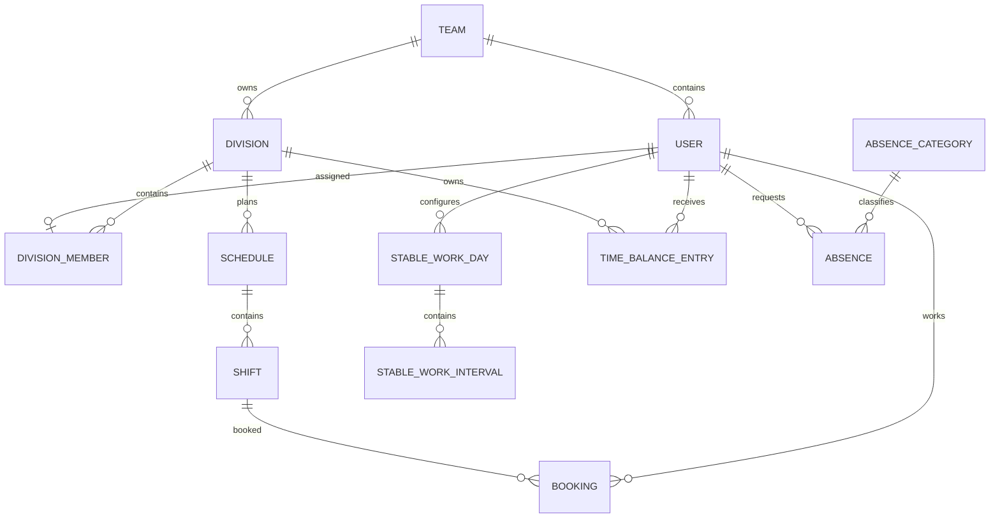

# Схема данных Outline + Schedule

Общая база PostgreSQL называется `outline`. Владельцем всех DDL-миграций является репозиторий `Outline-osp`.

`prisma/schema.prisma` в Schedule — только типизированное описание существующей базы для Prisma Client. Оно не является источником миграций.

## Схемы PostgreSQL

| Схема | Назначение | Владелец данных |
|---|---|---|
| `public` | пользователи, команды и группы доступа Outline | Outline |
| `schedule` | графики, подразделения, смены, отпуска и учёт времени | Schedule через миграции Outline |
| `attestation` | уровни и результаты аттестации | Outline/Grif |

## Личные данные

Личные данные хранятся только в `public.users`.

Schedule использует read-only представления:

- `schedule.users` → активные записи `public.users`;
- `schedule.organizations` → `public.teams`;
- `schedule.organization_members` → членство пользователей в workspace.

Пароли, сессии и email-верификация Schedule не хранит.

## Группы и подразделения

Группы Outline используются только для доступа к документам:

- `public.groups`;
- `public.group_users`.

Подразделения расписания независимы:

- `schedule.divisions`;
- `schedule.division_members`.

У подразделения есть:

- workspace;
- название, описание и цвет;
- режим `SHIFT` или `STABLE`;
- руководитель;
- создатель;
- soft-delete.

У назначения сотрудника есть дневная и недельная нормы времени. Ограничение `UNIQUE(userId)` разрешает только одно основное подразделение на сотрудника.

## Основные связи



Здесь `TEAM` и `USER` физически находятся в `public`, остальные сущности — в `schedule`.

## Таблицы Schedule

### Организационная структура

- `divisions` — независимые подразделения;
- `division_members` — одно основное подразделение и нормы сотрудника;
- `branches` — филиалы/площадки.

### Сменный график

- `schedules` — неделя, год, подразделение и филиал;
- `shifts` — интервалы смен;
- `bookings` — назначение сотрудников и переработка;
- `mod_requests` — запросы на изменение;
- `schedule_day_notes` — заметки и статусы дня;
- `schedule_day_offs` — выходные сотрудника;
- `shift_pool_templates` — шаблоны смен.

### Стабильный график

- `stable_work_days` — рабочий/выходной день и целевая длительность;
- `stable_work_intervals` — рабочие интервалы и перерывы;
- `time_balance_entries` — переработка, сокращение, использование баланса, административный отпуск и ручная корректировка.

### Live-режим

- `live_sessions`;
- `live_days`;
- `live_logs`.

Socket.IO не хранит авторизацию в этих таблицах: соединение проверяется через Auth.js и активного пользователя Outline.

### Учёт времени и отсутствия

- `time_categories`;
- `time_records`;
- `time_settings`;
- `absence_categories`;
- `absences`;
- `holidays`;
- `employee_notes`.

### Интеграция

- `outline_sso_tokens` — использованные одноразовые идентификаторы SSO-токенов.

Запись `jti` создаётся атомарно. Повторный вход с тем же токеном отклоняется.

## Внешние ключи

Schedule ссылается напрямую на Outline:

- `organizationId` → `public.teams(id)`;
- пользовательские идентификаторы → `public.users(id)`;
- `divisionId` графиков и смен → `schedule.divisions(id)`.

Удаление workspace каскадно удаляет его scheduling-данные. Удаление пользователя обрабатывается согласно назначению связи: критичные записи каскадируются, автор/руководитель может переводиться в `NULL`.

## Ограничения данных

Основные ограничения:

- один сотрудник — одно основное подразделение;
- один график на комбинацию workspace, подразделения, недели, года и филиала;
- одна бронь пользователя на смену;
- один стабильный день на пользователя и день недели;
- интервалы находятся в диапазоне суток и имеют `endMinute > startMinute`;
- нормы времени ограничены диапазоном суток/недели;
- переработка до и после смены кратна 30 минутам;
- `overtimeMinutes = overtimeBeforeMinutes + overtimeAfterMinutes`;
- записи баланса проверяют допустимый знак минут для своего типа.

Часть сложных ограничений и partial indexes не выражается в Prisma и остаётся только в Sequelize-миграциях Outline.

## Изменение схемы

Правильный порядок:

1. изменить `prisma/schema.prisma` как описание требуемых типов;
2. создать Sequelize-миграцию в `Outline-osp/server/migrations`;
3. добавить миграцию в `Outline-osp/server/scripts/export-schedule-migration-sql.js`;
4. обновить schema-contract тесты;
5. выполнить `npx prisma generate`;
6. проверить оба репозитория и общий Docker-стек.

Запрещено выполнять из Schedule:

```text
prisma migrate dev
prisma migrate deploy
prisma migrate reset
prisma db push
```

Эти команды создают второй источник DDL и могут повредить общую базу Outline.
